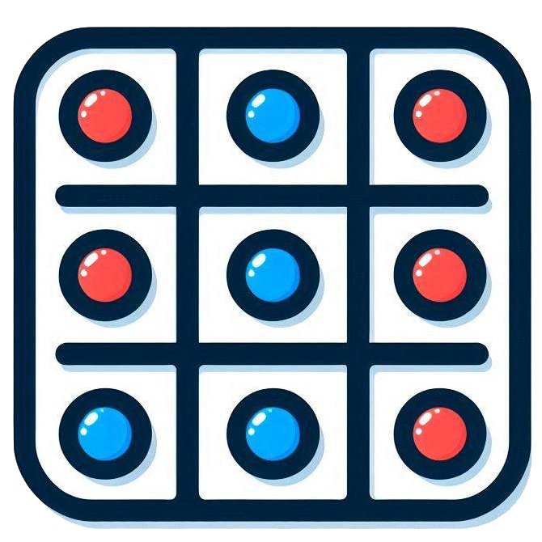

## Marca Pontos: Jogo e Simulador de Plano Cartesiano

Este projeto consiste em um jogo e um simulador para o aprendizado de probabilidade e coordenadas no plano cartesiano.

<p align="center">
  
</p>

### Descrição do Jogo

O "Marca Pontos" é um jogo para dois jogadores que combina sorte e estratégia no plano cartesiano. Os jogadores lançam dados e moedas para determinar coordenadas e competem para marcar pontos nos quatro quadrantes do plano.

**Como Jogar:**

1. **Lançamento:** Cada jogador lança dois dados e duas moedas.
2. **Coordenadas:** Os dados determinam os valores absolutos das coordenadas (x, y). As moedas definem os sinais: cara para positivo (+), coroa para negativo (-).
3. **Marcação:** O jogador escolhe quais combinações de dados e moedas usar para formar as coordenadas e marca o ponto correspondente no plano cartesiano.
4. **Eliminação:** Se um jogador marca um ponto já ocupado pelo oponente, ele perde todos os seus pontos marcados no tabuleiro.
5. **Vitória:** Vence o primeiro jogador a marcar uma quantidade predefinida de pontos em cada quadrante.

### Simulador

O simulador permite executar várias rodadas do jogo automaticamente, gerando dados estatísticos sobre a frequência de cada ponto no plano cartesiano.

**Funcionalidades:**

- Definir o número de simulações a serem executadas.
- No simulador, visualizar um relatório em tabela com a frequência de cada ponto e sua porcentagem.
- No simulador, gerar um mapa de calor (heatmap) que ilustra a distribuição dos pontos no plano cartesiano.
- No simulador, baixar os dados do relatório em formato CSV.

### Tecnologias Utilizadas

- **React:** Framework JavaScript para construção de interfaces de usuário.
- **React Plotly.js:** Biblioteca para criação de gráficos interativos.
- **File Saver:** Biblioteca para salvar arquivos no navegador.
- **Lucide React:** Biblioteca de ícones SVG.

### Como Executar o Projeto

1. **Clonar o Repositório:**
2. **Instalar as Dependências (pode usar o npm ou seu gerenciador de pacotes favorito):**
   ```bash
   npm install
   ```
3. **Iniciar o Servidor de Desenvolvimento:**
   ```bash
   npm run dev
   ```

### Contribuições

Contribuições são bem-vindas! Sinta-se à vontade para abrir issues e pull requests.
